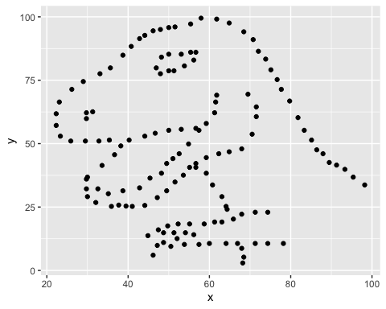
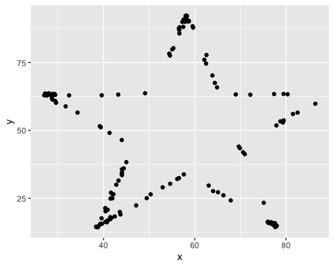
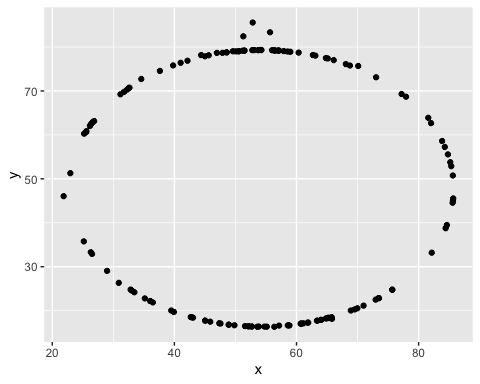
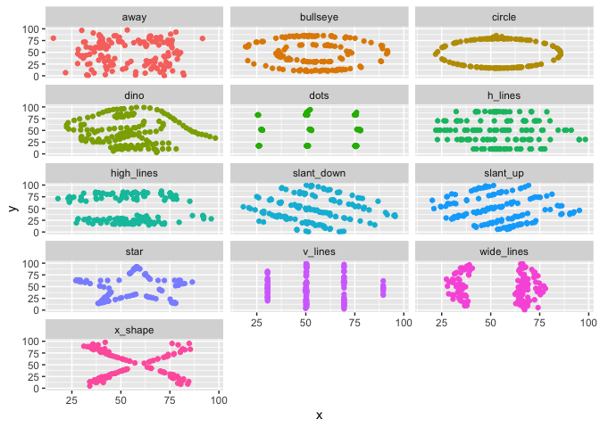

Lab 01 - Hello R
================
Rowan Kemmerly
1.23.23

## Load packages and data

``` r
library(tidyverse) 
library(datasauRus)
```

## Exercises

### Exercise 1

It has 13 rows and 6 columns. The variables included are “dataset”,
“mean_x”, “mean_y”, std_dev_x”, “std_dev_y”, and “corr_x\_y”.

### Exercise 2

``` r
dino_data <- datasaurus_dozen %>%
  filter(dataset == "dino")

ggplot(data = dino_data, mapping = aes(x = x, y = y)) +
  geom_point()
```

<!-- -->

``` r
dino_data %>%
  summarize(r = cor(x, y))
```

    ## # A tibble: 1 × 1
    ##         r
    ##     <dbl>
    ## 1 -0.0645

### Exercise 3

Even though this plot of the star dataset looks very different than the
code of the dino dataset…

``` r
star_data <- datasaurus_dozen %>%
  filter(dataset == "star")

ggplot(data = star_data, mapping = aes(x = x, y = y)) +
  geom_point()
```

<!-- -->

…the correlation coefficients between x and y for both datasets are the
same!

``` r
star_data %>%
  summarize(r = cor(x, y))
```

    ## # A tibble: 1 × 1
    ##         r
    ##     <dbl>
    ## 1 -0.0630

### Exercise 4

Plotting the “circle” dataset, we can see that again, these data appear
quite visually dissimilar to the dino data.

``` r
circle_data <- datasaurus_dozen %>%
  filter(dataset == "circle")

ggplot(data = circle_data, mapping = aes(x = x, y = y)) +
  geom_point()
```

<!-- -->

But the the correlation coefficient between x and y for this dataset is
only marginally lower than the correlation coefficient for the dino
dataset! (They are basically the same, almost certainly not
statistically different from one another.)

``` r
circle_data %>%
  summarize(r = cor(x, y))
```

    ## # A tibble: 1 × 1
    ##         r
    ##     <dbl>
    ## 1 -0.0683

### Exercise 5

We can see here that while all of the plots look different…

``` r
ggplot(datasaurus_dozen, aes(x = x, y = y, color = dataset))+
  geom_point()+
  facet_wrap(~ dataset, ncol = 3) +
  theme(legend.position = "none")
```

<!-- -->

…they all have virtually the same correlation coefficients between their
x and y variables!

``` r
datasaurus_dozen %>%
  group_by(dataset) %>%
  summarize(r = cor(x, y)) %>%
  print(13)
```

    ## # A tibble:
    ## #   13 × 2
    ##    dataset   
    ##    <chr>     
    ##  1 away      
    ##  2 bullseye  
    ##  3 circle    
    ##  4 dino      
    ##  5 dots      
    ##  6 h_lines   
    ##  7 high_lines
    ##  8 slant_down
    ##  9 slant_up  
    ## 10 star      
    ## 11 v_lines   
    ## 12 wide_lines
    ## 13 x_shape   
    ## # … with 1
    ## #   more
    ## #   variable:
    ## #   r <dbl>
